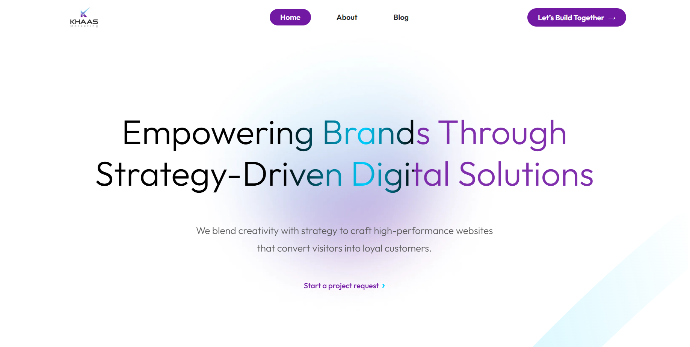

# Khaas Marketing WordPress Theme

A custom **WordPress theme** for **Khaas Marketing** — lightweight, responsive, SEO-friendly, and performance-optimized.  
Includes **Contact Form 7**, **Newsletter** integration, and **AOS** scroll animations.

> **Designed & developed by:** **Hassan Jamshaid** & **Ali Usman Khan**

---

## Preview


## Table of Contents

- [Features](#features)  
- [Tech Stack](#tech-stack)  
- [Requirements](#requirements)  
- [Installation](#installation)  
- [Required Plugins](#required-plugins)  
- [Plugin Configuration](#plugin-configuration)  
  - [Contact Form 7](#contact-form-7)  
  - [Newsletter](#newsletter)  
  - [Yoast SEO](#yoast-seo)  
  - [LiteSpeed Cache](#litespeed-cache)  
  - [Jetpack](#jetpack)  
  - [Akismet Anti-Spam](#akismet-anti-spam)  
  - [Google reCAPTCHA v3](#google-recaptcha-v3)  
- [AOS Setup](#aos-setup)  
- [Theme Structure](#theme-structure)  
- [Performance Checklist](#performance-checklist)  
- [Testing & QA](#testing--qa)  
- [Usage](#usage)  
- [Contributing](#contributing)  
- [Support](#support)  
- [Developers](#developers)  
- [License](#license)  

---

## Features

- 🎨 **Custom WordPress Theme** – Pixel-perfect implementation based on design mockups  
- 📬 **Contact Form 7 Integration** – Newsletter-ready with validation  
- 🎞️ **AOS Animations** – Smooth scroll & fade-in effects for sections  
- ⚡ **Performance Optimized** – Lazy loading, minified CSS/JS, optimized SVGs  
- 📱 **Responsive Design** – Works seamlessly across Desktop, Tablet & Mobile  
- 🛡️ **Security Ready** – Nonce protection, spam prevention, HTTPS ready  
- 🔎 **SEO Optimized** – Integrated with Yoast SEO for improved rankings  
- 🧩 **Dynamic Content** – Editable via WordPress Dashboard  

---

## Tech Stack

- **CMS:** WordPress (Custom Theme)  
- **Frontend:** HTML5, CSS3, JavaScript (with AOS.js)  
- **Backend:** PHP (WordPress Core)  
- **Database:** MySQL / MariaDB  

---

## Requirements

- WordPress (latest version)  
- PHP 7.4+  
- MySQL 5.7+ / MariaDB  
- SSL Certificate (for HTTPS)  

---

## Installation

1. Clone the repository:
   ```bash
   git clone https://github.com/hassan-jamshaid10/Khass-Marketing-Website.git
   ```

2. Upload the theme folder into:
   ```
   wp-content/themes/
   ```

3. Log in to **WordPress Admin Dashboard** → **Appearance → Themes** → Activate **Khaas Marketing Theme**.  

4. Install and activate all required plugins.  

---

## Required Plugins

- [Contact Form 7](https://wordpress.org/plugins/contact-form-7/) – Forms & Newsletter support  
- [Yoast SEO](https://wordpress.org/plugins/wordpress-seo/) – SEO optimization  
- [LiteSpeed Cache](https://wordpress.org/plugins/litespeed-cache/) – Caching & performance boost  
- [Newsletter](https://wordpress.org/plugins/newsletter/) – Email marketing & subscriber list  
- [Jetpack](https://wordpress.org/plugins/jetpack/) – Security, performance & monitoring tools  
- [Akismet Anti-Spam](https://wordpress.org/plugins/akismet/) – Spam protection for forms & comments  
- [Google reCAPTCHA v3](https://wordpress.org/plugins/advanced-nocaptcha-recaptcha/) – Bot protection for forms  

---

## Plugin Configuration

### Contact Form 7
- Update **recipient email** in **CF7 → Mail Settings**.  
- Configure `[response]` shortcode for success/error messages.  

### Newsletter
- Configure under **Newsletter → Settings**.  
- Add SMTP details for reliable delivery.  

### Yoast SEO
- Configure site title, meta descriptions, and sitemap.  
- Add keywords and social previews for each page/post.  

### LiteSpeed Cache
- Enable caching.  
- Configure **CSS/JS minification** and **image optimization**.  
- Exclude CF7 pages from aggressive caching.  

### Jetpack
- Enable **Brute Force Protection**.  
- Activate **Downtime Monitoring** and **Site Stats**.  

### Akismet Anti-Spam
- Register with API key (free for personal sites).  
- Filters spam from forms & comments.  

### Google reCAPTCHA v3
- Generate API keys from Google reCAPTCHA v3.  
- Configure under **Contact → Integration**.  

---

## AOS Setup

- AOS library is already included in the theme.  
- Add `data-aos` attributes to elements in templates, e.g.:  
  ```html
  <div data-aos="fade-up">Content</div>
  ```

---

## Theme Structure

```
Khass-Marketing-Website/
│
├── assets/          # Theme assets (CSS, JS, images, fonts)
├── inc/             # PHP includes & custom functions
├── templates/       # Template files
├── style.css        # Theme stylesheet & WordPress theme header info
├── functions.php    # Theme setup & WordPress hooks
└── index.php        # Main theme entry
```

---

## Performance Checklist

- ✅ Lazy loading images  
- ✅ Minified CSS/JS  
- ✅ Optimized SVGs/icons  
- ✅ Core Web Vitals score 90+  
- ✅ Responsive layout tested  

---

## Testing & QA

- ✅ Cross-browser tested (Chrome, Safari, Firefox, Edge)  
- ✅ Device tested (iPhone, Android, Desktop up to 1440px+)  
- ✅ Forms validated with valid/invalid inputs  
- ✅ Responsive down to 320px mobile screens  

---

## Usage

1. Install WordPress on your server.  
2. Clone or download this repository into `/wp-content/themes/`.  
3. Activate the theme via **Appearance → Themes**.  
4. Install & configure required plugins.  
5. Customize menus, widgets, and forms to match your needs.  

---

## Contributing

Contributions are welcome!  

1. Fork the repository  
2. Create a feature branch  
   ```bash
   git checkout -b feature-name
   ```
3. Commit changes  
   ```bash
   git commit -m "Added new feature"
   ```
4. Push to branch and submit a Pull Request  

---

## Support

For issues or feature requests, please open an issue in the [GitHub Issues](https://github.com/hassan-jamshaid10/Khass-Marketing-Website/issues) section.  

---

## Developers

- **Hassan Jamshaid** – Full Stack Developer  
- **Ali Usman Khan** – UI/UX Designer & Developer  

---

## License

This project is licensed under the **MIT License**.  
You may use, modify, and distribute with proper attribution.  
